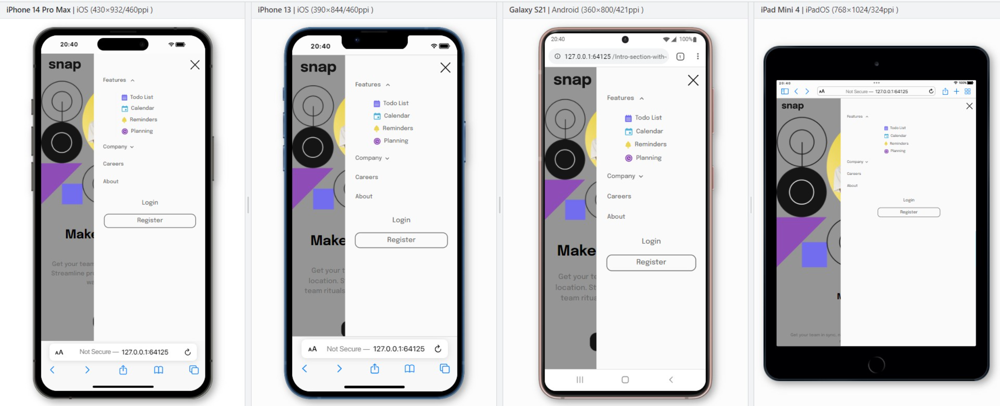

# Frontend Mentor - Intro section with dropdown navigation solution

This is a solution to the [Intro section with dropdown navigation challenge on Frontend Mentor](https://www.frontendmentor.io/challenges/intro-section-with-dropdown-navigation-ryaPetHE5). Frontend Mentor challenges help you improve your coding skills by building realistic projects.

## Table of contents

- [Frontend Mentor - Intro section with dropdown navigation solution](#frontend-mentor---intro-section-with-dropdown-navigation-solution)
  - [Table of contents](#table-of-contents)
  - [Overview](#overview)
    - [The challenge](#the-challenge)
    - [Screenshot](#screenshot)
    - [Links](#links)
  - [My process](#my-process)
    - [Built with](#built-with)
    - [What I learned](#what-i-learned)
  - [Author](#author)

## Overview

### The challenge

Users should be able to:

- View the relevant dropdown menus on desktop and mobile when interacting with the navigation links
- View the optimal layout for the content depending on their device's screen size
- See hover states for all interactive elements on the page

### Screenshot




### Links

- Solution URL: [GitHub](https://github.com/Gandah/Intro-section-with-dropdown-navigation-main.git)
- Live Site URL: [Live Site](https://your-live-site-url.com)

## My process

### Built with

- Semantic HTML5 markup
- CSS custom properties
- Flexbox
- CSS Grid
- Mobile-first workflow

### What I learned

-to use javascript to detect viewport size and apply styles only on some certain screen sizes.

To see how you can add code snippets, see below:

```js
function checkViewportSize() {
  if (window.matchMedia("(min-width: 1000px)").matches) {

     heroImage.src = "images/image-hero-desktop.png";
    if (closeButton) {
      closeButton.remove();
    }
  } else {
    // If viewport is less than 1000px, maintain the hamburger-menu-close element
    closeButton.style.display = 'block';
    heroImage.src = "images/image-hero-mobile.png";
  }
}
```

## Author

- Website - [MyLinkedIn](https://www.linkedin.com/in/gandahkelvin)
- Frontend Mentor - [@Gandah](https://www.frontendmentor.io/profile/Gandah)
- Twitter - [@mr_g4nderson](https://twitter.com/mr_g4nderson?t=A5NobjZab2sVEdh3Zq9s0A&s=09)
